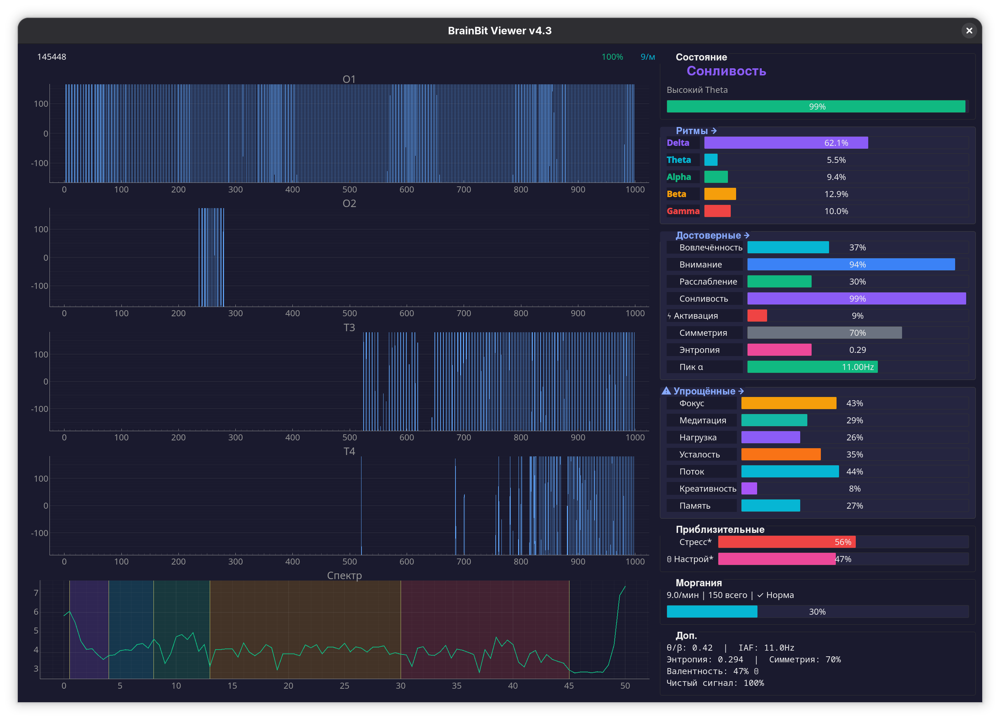

LSL для нейроинтерфейса от Brainbit ( Black ). для него нет открытого SDK, стандартно работает только с родным приложением...
любые тесты и комментарии приветствуются. Нацарапано с помощью AI, как быстрое решение....
протестировано на fedora linux. 

Server поддерживает замер качества прилегания контактов по импендансу, заряд батареи, передачу O1,O2,T3,T4.
MAC адрес устройства в сервере нужно заменить,пока нет параметра. будет исправлено, наверное, если кому то проект будет интересен ))

Viewer App Screenshot

